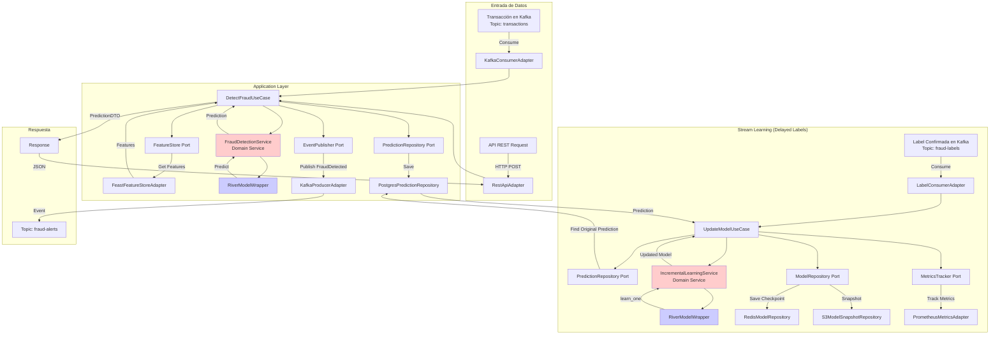
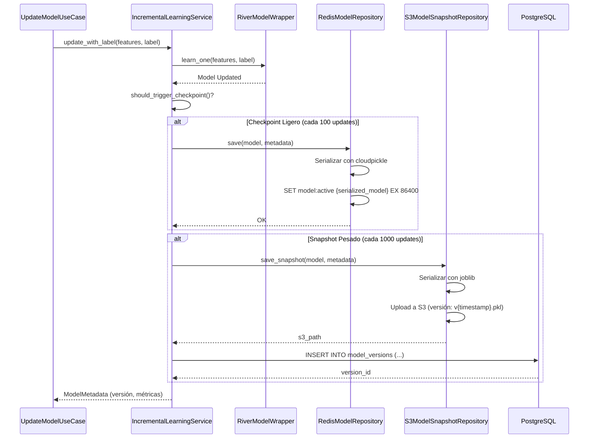

# Arquitectura de Sistema de Detección de Fraude Financiero en Tiempo Real
## Sistema de Stream Learning con Aprendizaje Incremental

**Versión:** 1.0  
**Fecha:** Enero 2026  
**Arquitecto:** Diseño basado en Arquitectura Hexagonal (Puertos y Adaptadores)

---

## Tabla de Contenidos

1. [Decisión Arquitectónica Principal](#decisión-arquitectónica-principal)
2. [Estructura de Carpetas](#estructura-de-carpetas)
3. [Responsabilidades por Capa](#responsabilidades-por-capa)
4. [Contratos de Puertos (Interfaces)](#contratos-de-puertos-interfaces)
5. [Flujo de Datos del Sistema](#flujo-de-datos-del-sistema)
6. [Estrategia de Persistencia del Estado](#estrategia-de-persistencia-del-estado)
7. [Manejo de Delayed Labels](#manejo-de-delayed-labels)
8. [Feature Store Architecture](#feature-store-architecture)
9. [Decisiones de Stack Tecnológico](#decisiones-de-stack-tecnológico)
10. [Principios SOLID Aplicados](#principios-solid-aplicados)

---

## 1. Decisión Arquitectónica Principal

### ¿Por qué Arquitectura Hexagonal?

**Decisión:** Se adopta **Arquitectura Hexagonal (Puertos y Adaptadores)** como patrón principal.

**Justificación Técnica:**

1. **Desacoplamiento del Dominio ML:** El modelo de `river` y las reglas de detección de fraude son el núcleo del negocio. La Hexagonal garantiza que este dominio no conozca si los datos vienen de Kafka, HTTP o CSV.

2. **Testabilidad Nativa:** Los puertos permiten inyectar mocks para unit tests sin dependencias externas (Kafka, Redis, PostgreSQL).

3. **Flexibilidad de Infraestructura:** Stream Learning requiere experimentación continua. Podemos cambiar de Kafka a Pulsar, de Redis a Memcached, o de PostgreSQL a TimescaleDB **sin tocar el dominio**.

4. **Caso de Uso Específico - Stream Learning:** A diferencia de CQRS (que optimiza para separar lecturas/escrituras en sistemas con alta carga de consultas), aquí el desafío es:
   - **Inferencia en tiempo real** (lectura)
   - **Actualización incremental del modelo** (escritura)
   - **Persistencia del estado del modelo** (checkpoint)

   La Hexagonal permite que estas tres responsabilidades sean coordinadas por el **Application Layer** usando puertos específicos, manteniendo la lógica de negocio (reglas de fraude, umbrales de confianza, políticas de re-entrenamiento) en el **Domain Layer**.

### Comparación con Event Sourcing

| Criterio | Hexagonal | Event Sourcing |
|----------|-----------|----------------|
| **Complejidad** | Moderada | Alta (requiere store de eventos, proyecciones) |
| **Audit Trail** | Requiere implementación explícita | Nativo (todos los eventos persisten) |
| **Replay de Estado** | Se debe diseñar (snapshots del modelo) | Nativo (recomputar desde eventos) |
| **Latencia** | Baja (inferencia directa) | Puede ser mayor (procesamiento de eventos) |
| **Manejo de Delayed Labels** | Flexible (eventos específicos) | Natural (evento "LabelConfirmed") |

**Conclusión:** Hexagonal es superior para este caso porque prioriza **latencia baja en inferencia** y **simplicidad en la gestión del estado del modelo**. Event Sourcing añadiría complejidad innecesaria para el problema específico de Stream Learning, aunque podría incorporarse parcialmente en el futuro para audit trail.

---

## 2. Estructura de Carpetas

```
fraud-detection-system/
│
├── src/
│   ├── domain/                              # CAPA DE DOMINIO (Núcleo de Negocio)
│   │   ├── __init__.py
│   │   ├── entities/                        # Entidades del dominio
│   │   │   ├── __init__.py
│   │   │   ├── transaction.py               # Entidad Transaction (Value Object)
│   │   │   ├── prediction.py                # Entidad Prediction (con metadata)
│   │   │   ├── fraud_label.py               # Entidad FraudLabel (delayed label)
│   │   │   └── model_metadata.py            # Metadatos del modelo (versión, métricas)
│   │   │
│   │   ├── value_objects/                   # Value Objects (inmutables)
│   │   │   ├── __init__.py
│   │   │   ├── transaction_id.py
│   │   │   ├── amount.py                    # Con validaciones de negocio
│   │   │   ├── merchant_category.py
│   │   │   └── fraud_score.py               # Score entre 0-1 con invariantes
│   │   │
│   │   ├── events/                          # Domain Events (para extensibilidad)
│   │   │   ├── __init__.py
│   │   │   ├── transaction_received.py
│   │   │   ├── fraud_detected.py
│   │   │   ├── model_updated.py
│   │   │   └── label_confirmed.py
│   │   │
│   │   ├── services/                        # Domain Services (lógica que no pertenece a una entidad)
│   │   │   ├── __init__.py
│   │   │   ├── fraud_detection_service.py   # Orquesta inferencia + reglas de negocio
│   │   │   ├── incremental_learning_service.py  # Lógica de cuándo/cómo actualizar
│   │   │   └── risk_scoring_service.py      # Combina múltiples señales de fraude
│   │   │
│   │   └── exceptions/                      # Excepciones de dominio
│   │       ├── __init__.py
│   │       ├── invalid_transaction.py
│   │       ├── model_not_ready.py
│   │       └── feature_missing.py
│   │
│   ├── application/                         # CAPA DE APLICACIÓN (Use Cases / Interactors)
│   │   ├── __init__.py
│   │   ├── ports/                           # PUERTOS (Interfaces / Contratos)
│   │   │   ├── __init__.py
│   │   │   │
│   │   │   ├── inbound/                     # Driving Ports (casos de uso entrantes)
│   │   │   │   ├── __init__.py
│   │   │   │   ├── fraud_detector.py        # Puerto para detección de fraude
│   │   │   │   ├── model_trainer.py         # Puerto para entrenamiento incremental
│   │   │   │   └── model_evaluator.py       # Puerto para evaluación del modelo
│   │   │   │
│   │   │   └── outbound/                    # Driven Ports (adaptadores salientes)
│   │   │       ├── __init__.py
│   │   │       ├── model_repository.py      # Persistencia del modelo
│   │   │       ├── transaction_stream.py    # Lectura de stream de transacciones
│   │   │       ├── label_stream.py          # Lectura de labels confirmados
│   │   │       ├── prediction_repository.py # Persistencia de predicciones
│   │   │       ├── feature_store.py         # Feature Store (lectura/escritura)
│   │   │       ├── event_publisher.py       # Publicación de eventos de dominio
│   │   │       └── metrics_tracker.py       # Tracking de métricas (Prometheus, etc.)
│   │   │
│   │   ├── use_cases/                       # Implementación de casos de uso
│   │   │   ├── __init__.py
│   │   │   ├── detect_fraud_use_case.py     # UC: Recibir transacción → Predecir fraude
│   │   │   ├── update_model_use_case.py     # UC: Recibir label → Actualizar modelo
│   │   │   ├── checkpoint_model_use_case.py # UC: Persistir estado del modelo
│   │   │   └── evaluate_model_use_case.py   # UC: Evaluar modelo en ventana temporal
│   │   │
│   │   └── dto/                             # Data Transfer Objects
│   │       ├── __init__.py
│   │       ├── transaction_dto.py
│   │       ├── prediction_dto.py
│   │       └── model_metrics_dto.py
│   │
│   ├── infrastructure/                      # CAPA DE INFRAESTRUCTURA (Adaptadores)
│   │   ├── __init__.py
│   │   │
│   │   ├── adapters/                        # Adaptadores (Implementaciones de Puertos)
│   │   │   ├── __init__.py
│   │   │   │
│   │   │   ├── inbound/                     # Adaptadores de entrada (API, Stream)
│   │   │   │   ├── __init__.py
│   │   │   │   ├── kafka_consumer_adapter.py        # Consume de Kafka
│   │   │   │   ├── rest_api_adapter.py              # FastAPI endpoints
│   │   │   │   └── grpc_adapter.py                  # gRPC para inferencia de baja latencia
│   │   │   │
│   │   │   └── outbound/                    # Adaptadores de salida (BD, Cache, Stream)
│   │   │       ├── __init__.py
│   │   │       ├── redis_model_repository.py        # Modelo en Redis (estado en memoria)
│   │   │       ├── postgres_prediction_repository.py # Predicciones en PostgreSQL
│   │   │       ├── kafka_producer_adapter.py        # Publica eventos a Kafka
│   │   │       ├── feast_feature_store_adapter.py   # Feature Store con Feast
│   │   │       ├── prometheus_metrics_adapter.py    # Métricas con Prometheus
│   │   │       └── s3_model_snapshot_repository.py  # Snapshots del modelo en S3
│   │   │
│   │   ├── ml/                              # Infraestructura ML específica
│   │   │   ├── __init__.py
│   │   │   ├── river_model_wrapper.py       # Wrapper para river (aísla la librería)
│   │   │   ├── model_serializer.py          # Serialización (pickle, joblib, cloudpickle)
│   │   │   └── feature_engineering.py       # Transformaciones de features
│   │   │
│   │   ├── persistence/                     # Configuración de persistencia
│   │   │   ├── __init__.py
│   │   │   ├── database.py                  # Configuración de PostgreSQL/SQLAlchemy
│   │   │   ├── redis_client.py              # Cliente de Redis
│   │   │   └── s3_client.py                 # Cliente de S3 (MinIO o AWS)
│   │   │
│   │   ├── messaging/                       # Configuración de mensajería
│   │   │   ├── __init__.py
│   │   │   ├── kafka_config.py              # Configuración de Kafka
│   │   │   └── schema_registry.py           # Integración con Schema Registry (Avro)
│   │   │
│   │   └── config/                          # Configuración de la aplicación
│   │       ├── __init__.py
│   │       ├── settings.py                  # Pydantic Settings (12-factor app)
│   │       └── dependency_injection.py      # Container de DI (dependency-injector)
│   │
│   └── interfaces/                          # Capa de Interfaces (Entry Points)
│       ├── __init__.py
│       ├── api/                             # API REST
│       │   ├── __init__.py
│       │   ├── main.py                      # FastAPI app
│       │   ├── routers/
│       │   │   ├── __init__.py
│       │   │   ├── fraud_detection.py       # Endpoint de predicción
│       │   │   ├── model_management.py      # Endpoints de administración del modelo
│       │   │   └── health.py                # Health checks
│       │   │
│       │   └── schemas/                     # Pydantic schemas (API contracts)
│       │       ├── __init__.py
│       │       ├── transaction_schema.py
│       │       └── prediction_schema.py
│       │
│       ├── cli/                             # CLI para operaciones manuales
│       │   ├── __init__.py
│       │   └── admin_commands.py            # Comandos de administración (Typer)
│       │
│       └── stream_processors/               # Procesadores de stream
│           ├── __init__.py
│           ├── transaction_processor.py     # Procesa stream de transacciones
│           └── label_processor.py           # Procesa stream de labels confirmados
│
├── tests/                                   # Tests (misma estructura que src)
│   ├── unit/
│   │   ├── domain/
│   │   ├── application/
│   │   └── infrastructure/
│   │
│   ├── integration/
│   │   ├── test_fraud_detection_flow.py
│   │   └── test_model_update_flow.py
│   │
│   └── e2e/
│       └── test_full_pipeline.py
│
├── deployment/                              # Configuración de despliegue
│   ├── docker/
│   │   ├── Dockerfile.api
│   │   ├── Dockerfile.stream_processor
│   │   └── docker-compose.yml
│   │
│   ├── kubernetes/
│   │   ├── api-deployment.yaml
│   │   ├── stream-processor-deployment.yaml
│   │   └── kafka-setup.yaml
│   │
│   └── terraform/                           # IaC para cloud (AWS/Azure/GCP)
│       └── main.tf
│
├── docs/                                    # Documentación
│   ├── adr/                                 # Architecture Decision Records
│   │   ├── 001-hexagonal-architecture.md
│   │   ├── 002-delayed-labels-strategy.md
│   │   └── 003-feature-store-design.md
│   │
│   └── diagrams/
│       ├── architecture-overview.mmd
│       └── data-flow.mmd
│
├── scripts/                                 # Scripts de utilidad
│   ├── init_db.py                           # Inicialización de BD
│   ├── seed_data.py                         # Datos de prueba
│   └── benchmark_model.py                   # Benchmarking de latencia
│
├── pyproject.toml                           # Poetry/PDM/Hatch config
├── Makefile                                 # Comandos de desarrollo
└── README.md

```

---

## 3. Responsabilidades por Capa

### 3.1 Domain Layer (`src/domain/`)

**Responsabilidad:** Contiene la lógica de negocio pura, agnóstica de la infraestructura.

- **Entities:** Objetos con identidad (Transaction, Prediction, FraudLabel).
- **Value Objects:** Objetos inmutables sin identidad (Amount, FraudScore, TransactionId).
- **Domain Services:** Lógica que no pertenece naturalmente a una entidad:
  - `FraudDetectionService`: Aplica reglas de negocio (umbrales, listas negras, patrones sospechosos).
  - `IncrementalLearningService`: Decide **cuándo** actualizar el modelo (cada N transacciones, cada X segundos, cuando drift > threshold).
  - `RiskScoringService`: Combina el score del modelo ML con reglas heurísticas.

- **Events:** Domain Events para desacoplar componentes (ej. `FraudDetected` → notificar al equipo de seguridad).
- **Exceptions:** Errores específicos del dominio (no HTTP 500, sino `InvalidTransaction`).

**Principio SOLID:** Single Responsibility Principle (SRP) - Cada entidad tiene una única razón para cambiar.

---

### 3.2 Application Layer (`src/application/`)

**Responsabilidad:** Orquesta los casos de uso usando los puertos (interfaces).

#### 3.2.1 Ports (`src/application/ports/`)

##### Inbound Ports (Driving Ports)
Interfaces que **exponen** funcionalidades del sistema hacia el mundo exterior.

- `FraudDetector`: `async def detect(transaction: Transaction) -> Prediction`
- `ModelTrainer`: `async def update_with_label(prediction_id, label: FraudLabel) -> ModelMetadata`
- `ModelEvaluator`: `async def evaluate(window: TimeWindow) -> Metrics`

##### Outbound Ports (Driven Ports)
Interfaces que el sistema **requiere** de la infraestructura.

- `ModelRepository`: Persistir/cargar el estado del modelo de `river`.
- `TransactionStream`: Leer transacciones desde Kafka.
- `LabelStream`: Leer labels confirmados desde Kafka (delayed labels).
- `PredictionRepository`: Guardar predicciones para unirlas con labels futuras.
- `FeatureStore`: Leer/escribir features para garantizar consistencia.
- `EventPublisher`: Publicar eventos de dominio.
- `MetricsTracker`: Rastrear métricas de performance (latencia, F1-score, etc.).

**Principio SOLID:** Dependency Inversion Principle (DIP) - Las capas superiores dependen de abstracciones (puertos), no de implementaciones concretas.

#### 3.2.2 Use Cases (`src/application/use_cases/`)

Cada caso de uso es una clase que implementa un puerto inbound y coordina múltiples puertos outbound.

**Ejemplo:** `DetectFraudUseCase`
1. Recibe `TransactionDTO`
2. Convierte a entidad `Transaction` (Domain)
3. Extrae features usando `FeatureStore` (outbound port)
4. Llama a `FraudDetectionService.detect()` (Domain Service)
5. Persiste `Prediction` usando `PredictionRepository` (outbound port)
6. Publica evento `FraudDetected` si score > threshold (outbound port)
7. Retorna `PredictionDTO`

**Principio SOLID:** Open/Closed Principle (OCP) - Nuevos casos de uso se añaden sin modificar existentes.

---

### 3.3 Infrastructure Layer (`src/infrastructure/`)

**Responsabilidad:** Implementa los puertos (adaptadores) con tecnologías específicas.

#### 3.3.1 Adapters (`src/infrastructure/adapters/`)

##### Inbound Adapters (Entry Points)
- `KafkaConsumerAdapter`: Consume del tópico `transactions`, deserializa Avro, llama a `DetectFraudUseCase`.
- `RestApiAdapter`: Expone endpoints HTTP para inferencia síncrona.
- `GrpcAdapter`: Expone servicio gRPC para inferencia de ultra-baja latencia.

##### Outbound Adapters (External Systems)
- `RedisModelRepository`: Guarda el modelo serializado en Redis (in-memory, rápido).
- `PostgresPredictionRepository`: Guarda predicciones en PostgreSQL (audit trail).
- `KafkaProducerAdapter`: Publica eventos a tópicos de Kafka.
- `FeastFeatureStoreAdapter`: Integra con Feast para features.
- `PrometheusMetricsAdapter`: Expone métricas en formato Prometheus.
- `S3ModelSnapshotRepository`: Guarda snapshots periódicos del modelo en S3 (disaster recovery).

**Principio SOLID:** Interface Segregation Principle (ISP) - Los adaptadores implementan solo los métodos que necesitan.

#### 3.3.2 ML Infrastructure (`src/infrastructure/ml/`)

- `RiverModelWrapper`: Encapsula el modelo de `river`, exponiendo una interfaz estándar:
  ```python
  def predict(features: dict) -> FraudScore
  def learn_one(features: dict, label: bool) -> None
  def serialize() -> bytes
  ```
  **Ventaja:** Si cambiamos de `river` a `scikit-multiflow` o a un modelo custom, solo cambiamos este wrapper.

- `ModelSerializer`: Maneja la serialización/deserialización del modelo (pickle, cloudpickle, dill).
- `FeatureEngineering`: Transformaciones de features (one-hot encoding, normalization, aggregations).

**Principio SOLID:** Liskov Substitution Principle (LSP) - Cualquier implementación de `ModelRepository` puede reemplazar a otra sin romper el sistema.

---

### 3.4 Interfaces Layer (`src/interfaces/`)

**Responsabilidad:** Exponer el sistema al mundo exterior (HTTP, CLI, Streams).

- `api/`: FastAPI application con routers.
- `cli/`: Comandos Typer para administración.
- `stream_processors/`: Procesadores que escuchan Kafka y llaman a use cases.

**Separación crítica:** Los routers NO contienen lógica de negocio. Solo:
1. Validan input (Pydantic schemas)
2. Convierten a DTO
3. Llaman al caso de uso correspondiente
4. Convierten el resultado a respuesta HTTP

---

## 4. Contratos de Puertos (Interfaces)

### 4.1 Inbound Ports

#### `FraudDetector` (Puerto de Detección)

```python
# src/application/ports/inbound/fraud_detector.py
from abc import ABC, abstractmethod
from typing import Protocol
from src.domain.entities.transaction import Transaction
from src.domain.entities.prediction import Prediction

class FraudDetector(Protocol):
    """
    Puerto inbound para detección de fraude.
    
    Contrato:
    - Recibe una transacción validada
    - Retorna una predicción con score de fraude (0-1)
    - Debe ser idempotente (misma transacción → mismo resultado en ventana temporal)
    - Latencia objetivo: P99 < 50ms
    """
    
    async def detect(self, transaction: Transaction) -> Prediction:
        """
        Detecta fraude en una transacción.
        
        Args:
            transaction: Entidad Transaction del dominio
            
        Returns:
            Prediction con fraud_score, model_version, features_used
            
        Raises:
            ModelNotReadyException: Si el modelo no está inicializado
            FeatureMissingException: Si faltan features críticas
        """
        ...
```

#### `ModelTrainer` (Puerto de Entrenamiento)

```python
# src/application/ports/inbound/model_trainer.py
from abc import ABC, abstractmethod
from typing import Protocol
from src.domain.entities.fraud_label import FraudLabel
from src.domain.entities.model_metadata import ModelMetadata
from src.domain.value_objects.transaction_id import TransactionId

class ModelTrainer(Protocol):
    """
    Puerto inbound para entrenamiento incremental.
    
    Contrato:
    - Recibe una label confirmada (delayed label)
    - Actualiza el modelo incrementalmente con river.learn_one()
    - Retorna metadatos actualizados del modelo
    - Thread-safe: Múltiples labels pueden llegar concurrentemente
    """
    
    async def update_with_label(
        self, 
        transaction_id: TransactionId, 
        label: FraudLabel
    ) -> ModelMetadata:
        """
        Actualiza el modelo con una label confirmada.
        
        Args:
            transaction_id: ID de la transacción original
            label: Label confirmada (is_fraud, confidence, source)
            
        Returns:
            ModelMetadata con nueva versión, métricas, timestamp
            
        Raises:
            PredictionNotFoundException: Si no se encuentra la predicción original
        """
        ...
    
    async def should_trigger_checkpoint(self) -> bool:
        """
        Determina si debe persistirse el estado del modelo.
        
        Returns:
            True si se debe hacer checkpoint (cada N updates, cada X tiempo)
        """
        ...
```

---

### 4.2 Outbound Ports

#### `ModelRepository` (Puerto de Persistencia del Modelo)

```python
# src/application/ports/outbound/model_repository.py
from abc import ABC, abstractmethod
from typing import Protocol, Optional
from src.domain.entities.model_metadata import ModelMetadata

class ModelRepository(Protocol):
    """
    Puerto outbound para persistencia del modelo de river.
    
    Contrato:
    - Guardar/Cargar el estado completo del modelo (pesos, estadísticas internas)
    - Soportar versionado (rollback si modelo nuevo degrada)
    - Operaciones atómicas (no estados parciales)
    
    Implementaciones:
    - RedisModelRepository: Estado en memoria (baja latencia)
    - S3ModelSnapshotRepository: Snapshots periódicos (disaster recovery)
    """
    
    async def save(self, model: object, metadata: ModelMetadata) -> None:
        """
        Persiste el estado del modelo.
        
        Args:
            model: Instancia del modelo de river (será serializado)
            metadata: Metadatos (versión, métricas, timestamp)
        """
        ...
    
    async def load(self, version: Optional[str] = None) -> tuple[object, ModelMetadata]:
        """
        Carga el estado del modelo.
        
        Args:
            version: Versión específica a cargar (None = última)
            
        Returns:
            Tupla (modelo_deserializado, metadata)
            
        Raises:
            ModelNotFoundException: Si no existe la versión solicitada
        """
        ...
    
    async def list_versions(self, limit: int = 10) -> list[ModelMetadata]:
        """Lista las últimas versiones del modelo disponibles."""
        ...
```

#### `PredictionRepository` (Puerto de Predicciones)

```python
# src/application/ports/outbound/prediction_repository.py
from abc import ABC, abstractmethod
from typing import Protocol, Optional
from src.domain.entities.prediction import Prediction
from src.domain.value_objects.transaction_id import TransactionId

class PredictionRepository(Protocol):
    """
    Puerto outbound para persistencia de predicciones.
    
    Contrato:
    - Guardar predicciones con TTL (para unir con delayed labels)
    - Búsqueda eficiente por transaction_id
    - Retención: 30 días (ajustable según SLA de labels)
    
    Casos de uso:
    - Almacenar predicción en tiempo T
    - Recuperar predicción en tiempo T+n cuando llega la label
    - Calcular métricas retrospectivas (precision, recall)
    """
    
    async def save(self, prediction: Prediction) -> None:
        """
        Persiste una predicción.
        
        Args:
            prediction: Entidad Prediction con score, features, timestamp
        """
        ...
    
    async def find_by_transaction_id(
        self, 
        transaction_id: TransactionId
    ) -> Optional[Prediction]:
        """
        Recupera una predicción por ID de transacción.
        
        Returns:
            Prediction si existe, None si expiró o no se encuentra
        """
        ...
    
    async def find_unlabeled(self, limit: int = 100) -> list[Prediction]:
        """
        Encuentra predicciones que aún no tienen label confirmada.
        
        Útil para:
        - Métricas de lag de labels
        - Notificar al equipo de revisión manual
        """
        ...
```

#### `FeatureStore` (Puerto de Feature Store)

```python
# src/application/ports/outbound/feature_store.py
from abc import ABC, abstractmethod
from typing import Protocol, Dict, Any
from datetime import datetime
from src.domain.value_objects.transaction_id import TransactionId

class FeatureStore(Protocol):
    """
    Puerto outbound para Feature Store.
    
    Contrato:
    - Garantizar consistencia entre features de entrenamiento e inferencia
    - Soportar features de ventana temporal (ej. "transacciones últimas 24h")
    - Point-in-time correctness (features al momento T, no futuras)
    
    Implementaciones:
    - FeastFeatureStoreAdapter (Feast)
    - RedisFeatureStoreAdapter (cache in-memory)
    - PostgresFeatureStoreAdapter (features batch)
    """
    
    async def get_online_features(
        self, 
        transaction_id: TransactionId,
        feature_names: list[str],
        timestamp: datetime
    ) -> Dict[str, Any]:
        """
        Obtiene features para inferencia online.
        
        Args:
            transaction_id: ID de la transacción
            feature_names: Lista de features a recuperar
            timestamp: Timestamp de la transacción (point-in-time)
            
        Returns:
            Diccionario {feature_name: value}
            
        Raises:
            FeatureMissingException: Si falta una feature crítica
        """
        ...
    
    async def write_features(
        self, 
        transaction_id: TransactionId,
        features: Dict[str, Any],
        timestamp: datetime
    ) -> None:
        """
        Escribe features al store.
        
        Args:
            transaction_id: ID de la transacción
            features: Diccionario de features
            timestamp: Timestamp de creación
        """
        ...
    
    async def get_feature_statistics(
        self, 
        feature_name: str,
        window: str  # "1h", "24h", "7d"
    ) -> Dict[str, float]:
        """
        Retorna estadísticas de una feature (mean, std, min, max).
        
        Útil para:
        - Detección de drift
        - Normalización dinámica
        """
        ...
```

#### `TransactionStream` (Puerto de Stream de Transacciones)

```python
# src/application/ports/outbound/transaction_stream.py
from abc import ABC, abstractmethod
from typing import Protocol, AsyncIterator
from src.domain.entities.transaction import Transaction

class TransactionStream(Protocol):
    """
    Puerto outbound para consumo de transacciones desde stream.
    
    Contrato:
    - Consumir transacciones en orden (si partición única) o paralelo (multi-partición)
    - Manejar backpressure (no colapsar si procesamiento es lento)
    - Garantizar at-least-once delivery (idempotencia del lado del consumer)
    
    Implementaciones:
    - KafkaTransactionStreamAdapter
    - KinesisTransactionStreamAdapter
    - RabbitMQTransactionStreamAdapter
    """
    
    async def consume(self) -> AsyncIterator[Transaction]:
        """
        Consume transacciones del stream.
        
        Yields:
            Transaction: Entidad validada del dominio
            
        Manejo de errores:
        - Transacción inválida → Loguear + enviar a DLQ + continuar
        - Error de red → Reintentar con backoff exponencial
        """
        ...
    
    async def commit_offset(self, transaction: Transaction) -> None:
        """
        Confirma el procesamiento exitoso de una transacción.
        
        Args:
            transaction: Transacción procesada
        """
        ...
```

#### `LabelStream` (Puerto de Stream de Labels)

```python
# src/application/ports/outbound/label_stream.py
from abc import ABC, abstractmethod
from typing import Protocol, AsyncIterator
from src.domain.entities.fraud_label import FraudLabel

class LabelStream(Protocol):
    """
    Puerto outbound para consumo de labels confirmadas (delayed labels).
    
    Contrato:
    - Consumir labels que llegan tiempo después de la transacción
    - Unir label con predicción original (join por transaction_id)
    - Manejar labels que llegan fuera de orden
    
    Flujo:
    1. Llega label en tiempo T+n
    2. Se busca la predicción original en PredictionRepository
    3. Se envía (features, label) al modelo para learn_one()
    4. Se calcula métrica retrospectiva (era correcto el score?)
    """
    
    async def consume(self) -> AsyncIterator[FraudLabel]:
        """
        Consume labels confirmadas del stream.
        
        Yields:
            FraudLabel: Label con transaction_id, is_fraud, confidence
        """
        ...
    
    async def commit_offset(self, label: FraudLabel) -> None:
        """Confirma el procesamiento exitoso de una label."""
        ...
```

#### `EventPublisher` (Puerto de Eventos)

```python
# src/application/ports/outbound/event_publisher.py
from abc import ABC, abstractmethod
from typing import Protocol
from src.domain.events.base_event import DomainEvent

class EventPublisher(Protocol):
    """
    Puerto outbound para publicación de eventos de dominio.
    
    Contrato:
    - Publicar eventos de forma asíncrona
    - Garantizar at-least-once delivery
    - Soportar schemas (Avro, Protobuf)
    
    Casos de uso:
    - FraudDetected → Notificar equipo de seguridad
    - ModelUpdated → Actualizar dashboard de métricas
    - LabelConfirmed → Audit trail
    """
    
    async def publish(self, event: DomainEvent) -> None:
        """
        Publica un evento de dominio.
        
        Args:
            event: Evento del dominio (FraudDetected, ModelUpdated, etc.)
        """
        ...
    
    async def publish_batch(self, events: list[DomainEvent]) -> None:
        """Publica múltiples eventos en batch (más eficiente)."""
        ...
```

#### `MetricsTracker` (Puerto de Métricas)

```python
# src/application/ports/outbound/metrics_tracker.py
from abc import ABC, abstractmethod
from typing import Protocol, Dict, Any

class MetricsTracker(Protocol):
    """
    Puerto outbound para tracking de métricas.
    
    Contrato:
    - Rastrear métricas de latencia (P50, P95, P99)
    - Rastrear métricas de ML (precision, recall, F1, AUC-ROC)
    - Rastrear métricas de negocio (fraudes detectados, falsos positivos)
    - Integración con Prometheus/Grafana
    
    Métricas críticas:
    - fraud_detection_latency_ms (histogram)
    - fraud_detection_score (gauge)
    - model_update_count (counter)
    - model_drift_score (gauge)
    """
    
    async def track_latency(self, operation: str, latency_ms: float) -> None:
        """Registra la latencia de una operación."""
        ...
    
    async def track_prediction(
        self, 
        score: float, 
        actual_label: bool | None = None
    ) -> None:
        """
        Registra una predicción (y opcionalmente su label real).
        
        Args:
            score: Score de fraude (0-1)
            actual_label: Label real (None si aún no está disponible)
        """
        ...
    
    async def track_model_metrics(self, metrics: Dict[str, float]) -> None:
        """
        Registra métricas del modelo (precision, recall, F1).
        
        Args:
            metrics: Diccionario con métricas calculadas
        """
        ...
    
    async def increment_counter(self, metric_name: str, value: int = 1) -> None:
        """Incrementa un contador (ej. "model_updates_total")."""
        ...
```

---

## 5. Flujo de Datos del Sistema

### 5.1 Diagrama de Flujo (Mermaid)



### 5.2 Descripción del Flujo

#### **Flujo 1: Detección de Fraude (Inferencia)**

1. **Entrada:** Transacción llega a Kafka (`transactions`) o API REST.
2. **Adaptador Inbound:** `KafkaConsumerAdapter` o `RestApiAdapter` deserializa y valida.
3. **Use Case:** `DetectFraudUseCase` se ejecuta.
4. **Feature Store:** Se obtienen features históricas (ej. "transacciones últimas 24h del comerciante").
5. **Domain Service:** `FraudDetectionService` aplica reglas de negocio:
   - ¿Está el monto en rango sospechoso?
   - ¿El comerciante está en lista negra?
6. **ML Inference:** `RiverModelWrapper.predict()` retorna score 0-1.
7. **Persistencia:** La predicción se guarda en `PostgresPredictionRepository` (para posterior join con label).
8. **Evento:** Si score > 0.8, se publica evento `FraudDetected` a Kafka (`fraud-alerts`).
9. **Respuesta:** Se retorna `PredictionDTO` al cliente (API) o se commitea offset (Kafka).

**Latencia Objetivo:** P99 < 50ms

---

#### **Flujo 2: Actualización del Modelo (Stream Learning)**

1. **Entrada:** Label confirmada llega a Kafka (`fraud-labels`) tiempo después (T+n).
   - Ejemplo: Transacción ocurre el lunes, el banco confirma el fraude el miércoles.

2. **Adaptador Inbound:** `LabelConsumerAdapter` deserializa la label.

3. **Use Case:** `UpdateModelUseCase` se ejecuta.

4. **Recuperación de Predicción:** Se busca la predicción original en `PredictionRepository` usando `transaction_id`.

5. **Domain Service:** `IncrementalLearningService` decide si actualizar el modelo:
   - ¿Han pasado N updates desde el último checkpoint?
   - ¿El modelo está en modo "learning" (no congelado)?

6. **ML Update:** `RiverModelWrapper.learn_one(features, label)` actualiza el modelo incrementalmente.

7. **Checkpoint:** Si `should_trigger_checkpoint()` retorna True:
   - El modelo se serializa y se guarda en `RedisModelRepository` (in-memory).
   - Cada X checkpoints, se guarda snapshot en `S3ModelSnapshotRepository` (disaster recovery).

8. **Métricas:** Se calculan métricas retrospectivas:
   - ¿Era correcta la predicción original?
   - Precision/Recall en ventana de tiempo.

9. **Evento:** Se publica evento `ModelUpdated` con nueva versión y métricas.

**Throughput Objetivo:** Procesar 1000 labels/segundo.

---

### 5.3 Gestión de Concurrencia

**Problema:** Múltiples labels pueden llegar concurrentemente y actualizar el modelo.

**Solución:**
- **Redis con Lock Distribuido:** Usar `SET key NX EX` para obtener lock antes de actualizar.
- **Versionado Optimista:** Cada update incrementa `model_version`. Si dos updates compiten, uno falla y reintenta.

**Pseudocódigo:**

```python
async def update_model_safely(self, features, label):
    async with self.distributed_lock("model_update_lock", timeout=5):
        model = await self.model_repository.load()
        model.learn_one(features, label)
        await self.model_repository.save(model)
```

---

## 6. Estrategia de Persistencia del Estado

### 6.1 Problema: Estado del Modelo de River

Los modelos de `river` mantienen estado interno (pesos, estadísticas de media/varianza, contadores, etc.). Si el servicio se reinicia, el modelo pierde todo el conocimiento adquirido (**Olvido Catastrófico**).

### 6.2 Estrategia Multi-Tier

#### **Tier 1: Redis (In-Memory - Baja Latencia)**

- **Propósito:** Estado activo del modelo para inferencia.
- **Frecuencia:** Checkpoint cada 100 updates o cada 5 minutos.
- **Serialización:** `cloudpickle` (soporta lambdas y closures).
- **TTL:** 24 horas (si no se actualiza, se considera stale).

**Ventajas:**
- Latencia de carga < 10ms.
- Permite reinicio rápido del servicio.

**Desventajas:**
- Si Redis cae, se pierde el estado reciente.

#### **Tier 2: S3/MinIO (Object Storage - Disaster Recovery)**

- **Propósito:** Snapshots periódicos del modelo.
- **Frecuencia:** Cada 1000 updates o cada hora.
- **Versionado:** `s3://models/fraud-detector/v{timestamp}.pkl`
- **Metadata:** JSON con métricas (precision, recall, F1, drift_score, training_samples_count).

**Ventajas:**
- Durabilidad alta.
- Permite rollback a versiones anteriores.

**Desventajas:**
- Latencia de carga > 500ms.

#### **Tier 3: PostgreSQL (Metadata)**

- **Propósito:** Registro de versiones del modelo (audit trail).
- **Esquema:**

```sql
CREATE TABLE model_versions (
    id SERIAL PRIMARY KEY,
    version VARCHAR(50) UNIQUE NOT NULL,
    created_at TIMESTAMP NOT NULL,
    s3_path VARCHAR(255) NOT NULL,
    metrics JSONB,  -- {precision, recall, f1, auc_roc}
    training_samples_count INT,
    drift_score FLOAT,
    is_active BOOLEAN DEFAULT TRUE
);

CREATE INDEX idx_model_versions_created_at ON model_versions(created_at DESC);
```

**Ventajas:**
- Permite consultas sobre el historial del modelo.
- Facilita A/B testing (comparar versión N vs N-1).

### 6.3 Workflow de Persistencia



### 6.4 Recuperación ante Fallos

#### **Escenario 1: Reinicio del Servicio**

1. Intentar cargar modelo desde Redis (`GET model:active`).
2. Si existe, deserializar y continuar.
3. Si no existe (cache expiró), cargar último snapshot de S3.
4. Si S3 no tiene snapshots (primer despliegue), inicializar modelo nuevo.

#### **Escenario 2: Degradación del Modelo**

Si las métricas caen (ej. F1-score < 0.7):

1. Consultar `model_versions` en PostgreSQL.
2. Identificar la última versión con F1-score > 0.8.
3. Cargar snapshot de S3 correspondiente.
4. Hacer rollback automático.

#### **Escenario 3: Pérdida Total de Redis**

1. Activar alerta (Prometheus → PagerDuty).
2. Cargar snapshot de S3 (latencia aumenta temporalmente).
3. Reconstruir cache de Redis.
4. Continuar operación normal.

### 6.5 Consideraciones de Performance

| Operación | Latencia | Throughput |
|-----------|----------|------------|
| **Inferencia** (modelo en memoria) | 1-5ms | 10,000 req/s |
| **Checkpoint a Redis** (cada 100 updates) | 10-50ms | 1,000 updates/s |
| **Snapshot a S3** (cada 1000 updates) | 500-2000ms | 100 snapshots/s |
| **Carga desde Redis** (restart) | 10-50ms | N/A |
| **Carga desde S3** (disaster recovery) | 500-3000ms | N/A |

**Recomendación:** Usar Redis para operaciones críticas de latencia, S3 para durabilidad.

---

## 7. Manejo de Delayed Labels

### 7.1 Problema

En detección de fraude, las labels llegan con retardo:

- **T+0:** Transacción ocurre → Modelo predice fraude (score: 0.85).
- **T+24h:** Banco revisa manualmente → Confirma fraude (label: `true`).
- **T+72h:** Usuario disputa → Label cambia a `false` (falso positivo).

**Desafío:** ¿Cómo unir la predicción en T+0 con la label en T+24h para re-entrenar?

### 7.2 Arquitectura de Delayed Labels

#### **Componente 1: Prediction Store (PostgreSQL)**

Cada predicción se guarda con:

```python
@dataclass
class Prediction:
    transaction_id: TransactionId
    timestamp: datetime
    fraud_score: float
    features: Dict[str, Any]  # Features usadas en inferencia
    model_version: str
    label: Optional[bool] = None  # Se actualiza cuando llega la label
    label_timestamp: Optional[datetime] = None
```

**Índices críticos:**
```sql
CREATE INDEX idx_predictions_transaction_id ON predictions(transaction_id);
CREATE INDEX idx_predictions_unlabeled ON predictions(timestamp) WHERE label IS NULL;
```

#### **Componente 2: Label Stream (Kafka Topic: `fraud-labels`)**

Las labels confirmadas se publican en un tópico separado:

```json
{
  "transaction_id": "txn_123456",
  "is_fraud": true,
  "confidence": 0.95,
  "source": "manual_review",
  "reviewed_by": "analyst@bank.com",
  "timestamp": "2026-01-22T10:30:00Z"
}
```

#### **Componente 3: Label Joiner (UpdateModelUseCase)**

```python
async def update_with_label(self, transaction_id, label):
    # 1. Buscar predicción original
    prediction = await self.prediction_repo.find_by_transaction_id(transaction_id)
    
    if not prediction:
        logger.warning(f"Prediction not found for {transaction_id} (expired or missing)")
        return
    
    # 2. Calcular métrica retrospectiva
    was_correct = (prediction.fraud_score > 0.5) == label.is_fraud
    await self.metrics_tracker.track_prediction(prediction.fraud_score, label.is_fraud)
    
    # 3. Actualizar modelo incrementalmente
    await self.incremental_learning_service.learn_one(
        features=prediction.features,
        label=label.is_fraud
    )
    
    # 4. Marcar predicción como labeled
    prediction.label = label.is_fraud
    prediction.label_timestamp = label.timestamp
    await self.prediction_repo.update(prediction)
    
    # 5. Publicar evento
    await self.event_publisher.publish(LabelConfirmed(transaction_id, label))
```

### 7.3 Estrategia de TTL (Time-To-Live)

**Problema:** No podemos guardar predicciones indefinidamente.

**Solución:** TTL basado en SLA del negocio.

| Escenario | TTL | Justificación |
|-----------|-----|---------------|
| **Labels rápidas** (auto-confirmadas por API bancaria) | 48 horas | 95% de labels llegan en < 24h |
| **Labels manuales** (revisión de analistas) | 7 días | Tiempo máximo de revisión manual |
| **Disputas de usuarios** (casos legales) | 30 días | Plazo legal para disputar transacciones |

**Implementación:**

```sql
-- Particionar tabla de predicciones por timestamp (PostgreSQL 12+)
CREATE TABLE predictions (
    ...
) PARTITION BY RANGE (timestamp);

-- Crear particiones mensuales
CREATE TABLE predictions_2026_01 PARTITION OF predictions
    FOR VALUES FROM ('2026-01-01') TO ('2026-02-01');

-- Job mensual para eliminar particiones antiguas (> 30 días)
DROP TABLE predictions_2025_11;
```

### 7.4 Manejo de Labels Fuera de TTL

Si una label llega después del TTL:

1. **Loguear el evento:** Para análisis de SLA.
2. **NO actualizar el modelo:** El contexto (features) ya no está disponible.
3. **Incrementar métrica:** `late_labels_count` (alertar si aumenta).

**Recomendación:** Negociar con el negocio para reducir el lag de labels (ej. integración con API bancaria para auto-confirmación).

---

## 8. Feature Store Architecture

### 8.1 Propósito

El Feature Store garantiza **consistencia entre entrenamiento e inferencia**:

- **Problema:** Si en entrenamiento usas `merchant_avg_amount_last_7d` calculado con SQL, pero en inferencia lo calculas con Python, pueden haber inconsistencias (timezone, redondeo, lógica).
- **Solución:** Centralizar la definición y cómputo de features.

### 8.2 Feature Store Lógico

En este diseño, el Feature Store es **lógico** (no requiere Feast inicialmente):

#### **Tier 1: Online Features (Redis)**

Features pre-computadas para inferencia rápida:

```python
# Estructura en Redis:
# Key: "features:merchant:{merchant_id}"
# Value: JSON comprimido con features agregadas

{
    "merchant_id": "merchant_789",
    "avg_amount_7d": 150.50,
    "transaction_count_24h": 12,
    "fraud_rate_30d": 0.05,
    "last_updated": "2026-01-20T10:00:00Z"
}
```

**Actualización:** Job asíncrono (Spark Streaming, Flink) que lee transacciones y actualiza Redis cada 5 minutos.

#### **Tier 2: Batch Features (PostgreSQL/Data Warehouse)**

Features históricas para análisis y re-training batch (opcional):

```sql
CREATE TABLE merchant_features (
    merchant_id VARCHAR(50),
    date DATE,
    avg_amount DECIMAL(10, 2),
    transaction_count INT,
    fraud_rate DECIMAL(5, 4),
    PRIMARY KEY (merchant_id, date)
);
```

### 8.3 Feature Store Físico (Feast - Recomendación Futura)

Cuando el sistema escale, migrar a **Feast**:

1. **Definición de Features** (Python):

```python
# features/merchant_features.py
from feast import Entity, Feature, FeatureView, Field
from feast.types import Float64, Int64

merchant = Entity(name="merchant_id", description="Merchant ID")

merchant_features = FeatureView(
    name="merchant_stats",
    entities=[merchant],
    schema=[
        Field(name="avg_amount_7d", dtype=Float64),
        Field(name="transaction_count_24h", dtype=Int64),
        Field(name="fraud_rate_30d", dtype=Float64),
    ],
    source=RedisSource(...),
    ttl=timedelta(days=7),
)
```

2. **Inferencia:**

```python
features = feast_client.get_online_features(
    entity_rows=[{"merchant_id": "merchant_789"}],
    features=["merchant_stats:avg_amount_7d", "merchant_stats:transaction_count_24h"],
).to_dict()
```

### 8.4 Point-in-Time Correctness

**Problema:** En T+0 predecimos fraude. En T+24h llega la label. ¿Qué features usamos para re-entrenar?

**Solución:** Guardar las features usadas en la predicción original:

```python
@dataclass
class Prediction:
    ...
    features: Dict[str, Any]  # Snapshot de features en tiempo T
```

**Ventaja:** Garantiza que el re-entrenamiento usa las mismas features que la inferencia (no features futuras que causan data leakage).

---

## 9. Decisiones de Stack Tecnológico

### 9.1 Recomendaciones (Agnósticas al Diseño)

| Componente | Opción Recomendada | Alternativas | Justificación |
|------------|-------------------|--------------|---------------|
| **Stream Platform** | Apache Kafka | AWS Kinesis, Pulsar | Ecosistema maduro, Schema Registry, Connect |
| **API Framework** | FastAPI | Flask, Django | Async nativo, validación con Pydantic, performance |
| **Stream Processing** | Python + aiokafka | Flink, Kafka Streams | Simplicidad, mismo stack que ML |
| **Model Library** | river | scikit-multiflow, Vowpal Wabbit | Activo, API Pythonic, soporte streaming |
| **Feature Store** | Feast | Tecton, Hopsworks | Open-source, integración con Redis/PostgreSQL |
| **Model Storage** | Redis + S3/MinIO | PostgreSQL BYTEA, MongoDB | Redis: baja latencia, S3: durabilidad |
| **Metrics** | Prometheus + Grafana | DataDog, New Relic | Open-source, integración con Kubernetes |
| **Database** | PostgreSQL | MySQL, CockroachDB | JSONB para features, particionamiento nativo |
| **Message Format** | Avro + Schema Registry | Protobuf, JSON | Versionado de schemas, compresión |
| **Containerization** | Docker + Kubernetes | Docker Swarm, Nomad | Estándar de facto, escalabilidad |
| **Dependency Injection** | dependency-injector | punq, lagom | Type-safe, integración con FastAPI |
| **Testing** | pytest + pytest-asyncio | unittest | Soporte async, fixtures potentes |

### 9.2 Configuración de Ejemplo (Docker Compose)

```yaml
version: '3.8'
services:
  # Stream Platform
  kafka:
    image: confluentinc/cp-kafka:7.5.0
    environment:
      KAFKA_BROKER_ID: 1
      KAFKA_ZOOKEEPER_CONNECT: zookeeper:2181
      KAFKA_ADVERTISED_LISTENERS: PLAINTEXT://kafka:9092
  
  # Schema Registry
  schema-registry:
    image: confluentinc/cp-schema-registry:7.5.0
    depends_on:
      - kafka
  
  # Model Storage (In-Memory)
  redis:
    image: redis:7-alpine
    command: redis-server --maxmemory 2gb --maxmemory-policy allkeys-lru
  
  # Prediction Storage
  postgres:
    image: postgres:15-alpine
    environment:
      POSTGRES_DB: fraud_detection
      POSTGRES_USER: user
      POSTGRES_PASSWORD: password
  
  # Model Snapshots
  minio:
    image: minio/minio:latest
    command: server /data
    environment:
      MINIO_ROOT_USER: admin
      MINIO_ROOT_PASSWORD: password
  
  # Metrics
  prometheus:
    image: prom/prometheus:latest
    volumes:
      - ./prometheus.yml:/etc/prometheus/prometheus.yml
  
  grafana:
    image: grafana/grafana:latest
    depends_on:
      - prometheus
```

---

## 10. Principios SOLID Aplicados

### 10.1 Single Responsibility Principle (SRP)

**Aplicación:**
- `FraudDetectionService` → Solo detecta fraude (reglas de negocio).
- `IncrementalLearningService` → Solo decide cuándo/cómo actualizar el modelo.
- `RiverModelWrapper` → Solo encapsula el modelo de `river`.

**Anti-patrón evitado:**
```python
# ❌ MAL: Una clase hace todo
class FraudDetector:
    def detect_and_train_and_save(self, transaction, label=None):
        # Detecta fraude
        # Actualiza modelo
        # Guarda en BD
        # Publica evento
        # ...
```

**Patrón correcto:**
```python
# ✅ BIEN: Responsabilidades separadas
class DetectFraudUseCase:
    def __init__(
        self, 
        fraud_detector: FraudDetector,
        prediction_repo: PredictionRepository,
        event_publisher: EventPublisher
    ):
        # Cada componente tiene una responsabilidad
```

---

### 10.2 Open/Closed Principle (OCP)

**Aplicación:**
- **Abierto para extensión:** Puedo agregar un nuevo `GrpcAdapter` sin modificar `DetectFraudUseCase`.
- **Cerrado para modificación:** Agregar un nuevo puerto outbound no requiere cambiar el dominio.

**Ejemplo:**

```python
# Agregar soporte para un nuevo stream platform (Pulsar):
# 1. Crear PulsarTransactionStreamAdapter (implementa TransactionStream port)
# 2. Configurar en dependency_injection.py
# 3. NO tocar DetectFraudUseCase ni FraudDetectionService
```

---

### 10.3 Liskov Substitution Principle (LSP)

**Aplicación:**
- Cualquier implementación de `ModelRepository` debe ser intercambiable:
  - `RedisModelRepository`
  - `S3ModelSnapshotRepository`
  - `PostgresModelRepository` (hipotético)

**Contrato garantizado:**
```python
# Todas deben cumplir el contrato del puerto:
async def save(self, model: object, metadata: ModelMetadata) -> None
async def load(self, version: Optional[str] = None) -> tuple[object, ModelMetadata]
```

**Test de sustitución:**
```python
# Los tests deben pasar con cualquier implementación
@pytest.mark.parametrize("repo", [
    RedisModelRepository(...),
    S3ModelSnapshotRepository(...),
])
async def test_model_persistence(repo):
    model = create_test_model()
    await repo.save(model, metadata)
    loaded, _ = await repo.load()
    assert loaded == model
```

---

### 10.4 Interface Segregation Principle (ISP)

**Aplicación:**
- Los puertos son específicos (no interfaces "God"):
  - `FraudDetector` → Solo `detect()`
  - `ModelTrainer` → Solo `update_with_label()`, `should_trigger_checkpoint()`
  - `PredictionRepository` → Solo métodos relacionados con predicciones

**Anti-patrón evitado:**
```python
# ❌ MAL: Interface inflada
class FraudSystemPort:
    def detect(self, transaction): ...
    def train(self, label): ...
    def save_model(self, model): ...
    def load_model(self): ...
    def publish_event(self, event): ...
    # Un adaptador tendría que implementar TODO esto
```

**Patrón correcto:**
```python
# ✅ BIEN: Interfaces segregadas
class FraudDetector(Protocol):
    def detect(self, transaction): ...

class ModelTrainer(Protocol):
    def update_with_label(self, label): ...
```

---

### 10.5 Dependency Inversion Principle (DIP)

**Aplicación:**
- Las capas de alto nivel (Domain, Application) **no dependen** de capas de bajo nivel (Infrastructure).
- Ambas dependen de **abstracciones** (Puertos).

**Ejemplo:**

```python
# ❌ MAL: Application depende de Infrastructure
from infrastructure.adapters.outbound.redis_model_repository import RedisModelRepository

class DetectFraudUseCase:
    def __init__(self):
        self.model_repo = RedisModelRepository()  # Dependencia concreta


# ✅ BIEN: Application depende de abstracción (puerto)
from application.ports.outbound.model_repository import ModelRepository

class DetectFraudUseCase:
    def __init__(self, model_repo: ModelRepository):
        self.model_repo = model_repo  # Abstracción (inyectada)
```

**Inyección de dependencias:**
```python
# infrastructure/config/dependency_injection.py
from dependency_injector import containers, providers

class Container(containers.DeclarativeContainer):
    config = providers.Configuration()
    
    # Adaptadores outbound
    model_repo = providers.Singleton(
        RedisModelRepository,
        redis_client=providers.Dependency()
    )
    
    # Use cases
    detect_fraud_use_case = providers.Factory(
        DetectFraudUseCase,
        model_repo=model_repo
    )
```

---

## 11. Testing Strategy

### 11.1 Pirámide de Tests

```
           /\
          /  \  E2E Tests (5%)
         /____\
        /      \  Integration Tests (15%)
       /________\
      /          \  Unit Tests (80%)
     /____________\
```

### 11.2 Unit Tests (Domain + Application)

**Objetivo:** Probar lógica de negocio en aislamiento.

**Ejemplo:**

```python
# tests/unit/domain/services/test_fraud_detection_service.py
import pytest
from unittest.mock import Mock
from domain.services.fraud_detection_service import FraudDetectionService
from domain.entities.transaction import Transaction

@pytest.fixture
def mock_model():
    model = Mock()
    model.predict.return_value = 0.85
    return model

async def test_detect_fraud_high_score(mock_model):
    service = FraudDetectionService(model=mock_model)
    transaction = Transaction(amount=10000, merchant="suspicious_merchant")
    
    prediction = await service.detect(transaction)
    
    assert prediction.fraud_score == 0.85
    assert prediction.is_high_risk is True
    mock_model.predict.assert_called_once()
```

**Ventaja:** No requiere Kafka, Redis, PostgreSQL. Tests rápidos (< 1s).

### 11.3 Integration Tests (Application + Infrastructure)

**Objetivo:** Probar interacción con infraestructura real.

**Ejemplo:**

```python
# tests/integration/test_fraud_detection_flow.py
import pytest
import pytest_asyncio
from testcontainers.redis import RedisContainer

@pytest_asyncio.fixture
async def redis_container():
    with RedisContainer("redis:7-alpine") as redis:
        yield redis

async def test_model_persistence_in_redis(redis_container):
    repo = RedisModelRepository(redis_url=redis_container.get_connection_url())
    model = create_test_model()
    
    await repo.save(model, metadata)
    loaded, _ = await repo.load()
    
    assert type(loaded) == type(model)
```

**Herramientas:**
- `testcontainers-python`: Levanta contenedores (Redis, Kafka, PostgreSQL) para tests.
- `pytest-asyncio`: Soporte para tests async.

### 11.4 E2E Tests

**Objetivo:** Probar el flujo completo end-to-end.

**Ejemplo:**

```python
# tests/e2e/test_full_pipeline.py
async def test_transaction_to_prediction_to_model_update():
    # 1. Publicar transacción en Kafka
    await kafka_producer.send("transactions", transaction_data)
    
    # 2. Verificar predicción en PostgreSQL
    await asyncio.sleep(1)  # Esperar procesamiento
    prediction = await postgres_client.query("SELECT * FROM predictions WHERE transaction_id = '...'")
    assert prediction.fraud_score > 0.5
    
    # 3. Publicar label confirmada en Kafka
    await kafka_producer.send("fraud-labels", label_data)
    
    # 4. Verificar modelo actualizado en Redis
    await asyncio.sleep(1)
    model_metadata = await redis_client.get("model:metadata")
    assert model_metadata.training_samples_count == 1
```

---

## 12. Consideraciones de Deployment

### 12.1 Kubernetes Architecture

```yaml
# deployment/kubernetes/api-deployment.yaml
apiVersion: apps/v1
kind: Deployment
metadata:
  name: fraud-detection-api
spec:
  replicas: 3
  selector:
    matchLabels:
      app: fraud-detection-api
  template:
    spec:
      containers:
      - name: api
        image: fraud-detection-api:latest
        resources:
          requests:
            memory: "512Mi"
            cpu: "500m"
          limits:
            memory: "1Gi"
            cpu: "1000m"
        env:
        - name: REDIS_URL
          valueFrom:
            secretKeyRef:
              name: redis-credentials
              key: url
        livenessProbe:
          httpGet:
            path: /health
            port: 8000
          initialDelaySeconds: 10
          periodSeconds: 5
```

### 12.2 Scaling Strategy

| Componente | Estrategia | Trigger |
|------------|-----------|---------|
| **API (Inferencia)** | Horizontal Pod Autoscaler (HPA) | CPU > 70% o Latencia P99 > 100ms |
| **Stream Processor** | Kafka Consumer Groups (particiones) | Lag > 1000 mensajes |
| **Redis** | Redis Cluster (sharding) | Memory usage > 80% |
| **PostgreSQL** | Read replicas + Particionamiento | Queries/s > 1000 |

### 12.3 Observability

**Métricas Críticas (Prometheus):**

```python
# Latencia de inferencia
fraud_detection_latency_ms = Histogram(
    'fraud_detection_latency_ms',
    'Latency of fraud detection in milliseconds',
    buckets=[10, 25, 50, 100, 250, 500, 1000]
)

# Throughput
fraud_detection_total = Counter(
    'fraud_detection_total',
    'Total number of fraud detections'
)

# Score distribution
fraud_score = Histogram(
    'fraud_score',
    'Distribution of fraud scores',
    buckets=[0.1, 0.2, 0.3, 0.4, 0.5, 0.6, 0.7, 0.8, 0.9, 1.0]
)

# Model metrics
model_f1_score = Gauge(
    'model_f1_score',
    'Current F1 score of the model'
)
```

**Dashboards (Grafana):**
- **Operational:** Latencia, throughput, error rate.
- **ML Metrics:** Precision, recall, F1, AUC-ROC.
- **Business Metrics:** Fraudes detectados, falsos positivos, $ bloqueado.

---

## 13. Extensiones Futuras

### 13.1 Multi-Model Ensemble

Usar múltiples modelos y combinar sus predicciones:

```python
# domain/services/ensemble_fraud_detector.py
class EnsembleFraudDetector:
    def __init__(self, models: list[FraudDetector]):
        self.models = models
    
    async def detect(self, transaction):
        scores = [await model.detect(transaction) for model in self.models]
        final_score = np.mean([s.fraud_score for s in scores])
        return Prediction(fraud_score=final_score, ...)
```

### 13.2 Concept Drift Detection

Detectar cuando el modelo degrada por cambios en la distribución:

```python
# domain/services/drift_detector.py
class DriftDetector:
    def __init__(self, reference_distribution):
        self.reference = reference_distribution
    
    async def detect_drift(self, current_features):
        drift_score = kolmogorov_smirnov_test(self.reference, current_features)
        if drift_score > 0.3:
            await self.event_publisher.publish(DriftDetected(drift_score))
```

### 13.3 Explainability (SHAP/LIME)

Explicar por qué se predijo fraude:

```python
# application/use_cases/explain_prediction_use_case.py
class ExplainPredictionUseCase:
    async def explain(self, prediction_id):
        prediction = await self.prediction_repo.find(prediction_id)
        shap_values = self.explainer.explain(prediction.features)
        return {feature: contribution for feature, contribution in shap_values}
```

---

## 14. Conclusión

Este diseño proporciona:

1. **Desacoplamiento:** El modelo de ML no conoce Kafka, Redis o PostgreSQL.
2. **Testabilidad:** Cada capa puede probarse en aislamiento.
3. **Escalabilidad:** Añadir nuevos adaptadores (gRPC, WebSocket) no afecta el dominio.
4. **Mantenibilidad:** Los cambios en la infraestructura (cambiar de Redis a Memcached) no afectan la lógica de negocio.
5. **Stream Learning:** El sistema re-entrena incrementalmente con `river`, manejando delayed labels y persistencia del estado.

**Próximos pasos:**
1. Implementar los adaptadores básicos (Kafka, Redis, PostgreSQL).
2. Dockerizar los servicios.
3. Configurar CI/CD con tests automatizados.
4. Desplegar en Kubernetes con monitoreo (Prometheus + Grafana).

---

**Documentación adicional:**
- ADR (Architecture Decision Records) en `docs/adr/`
- Diagramas C4 en `docs/diagrams/`
- Runbooks para operación en producción en `docs/runbooks/`
